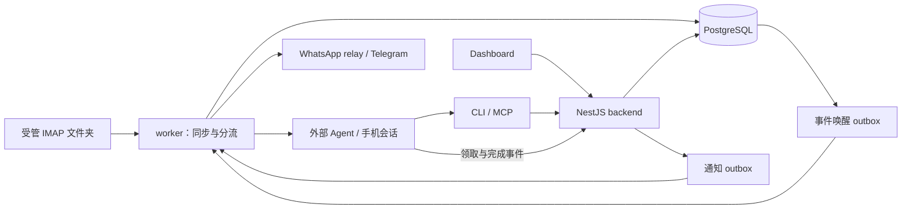

# SC Mail 当前架构与开发依据

更新：2026-10-07。本文描述当前仓库实现和必须维持的产品约束；部署与验证结果以 [README](README.md) 为入口。正文/关联导航、手动 CRM、项目分析、投递报告及项目详情分区已实现；CLI/MCP 已补齐联系人、公司、项目增删改查。OpenClaw CRM/分析工具现已授权并通过实际工具发现及只读查询，本轮没有新增 Schema 或 Migration，仍为 27。项目通知、手机整套建档和旧复核内联浏览器流程待独立验收；全页面移动端视觉验收尚未完成。分项见 [CRM/投递/UI 记录](docs/ACCEPTANCE_MANUAL_CRM_PROJECT_AI_2026-10-02.md) 与 [CLI 接入记录](docs/ACCEPTANCE_CRM_CLI_2026-10-07.md)。

本文负责架构与跨模块规则；[文档目录](docs/README.md) 指向接口、运维和接入契约；[Problem](Problem.md) 仅列未完成项。旧 v1.2 的设想目录、模型与执行步骤退出当前依据，见 [旧设计归档](docs/archive/PROJECT_DEVELOPMENT_v1.2_2026-09-29.md)。不一致时先核实代码和验收，明确缺口并同步文档，不能把未实现设计写成事实。

## 产品范围

SC Mail 是独立商务邮件服务，保存邮件证据、联系人/公司、项目/Topic、任务、需求、决策、摘要和来源历史。产品与 Dashboard 使用 SC Mail；`ai-mail` CLI、API/Agent/MCP 标识保留兼容。

支持用户自然语言、邮件事件、定时任务三种入口。手机会话复用 Agent 宿主渠道，当前接入 OpenClaw WhatsApp，内置 Telegram 桥接可选。手机对话有用户可用反馈，独立端到端验收仍待完成。Hermes、Codex、Claude 等兼容性未经验证。

核心服务不依赖 Agent 在线。Agent 通过 API/CLI/MCP 查询或执行获授权业务操作，不直接连接业务数据库。Skill 是使用指导；安装不启动程序、不配置 MCP，也不建立唤醒。

首版没有自动客户发信。受管 IMAP 文件夹中的已发副本可查询；外部 SMTP 群发无 IMAP 副本时不可见，不能推断完整发件历史或 Campaign 状态。现有 `OutreachCampaign` 和 promote 接口是兼容代码，不代表已接通外部群发程序。

## 运行结构

TypeScript/NestJS 模块化单体，Prisma 访问 PostgreSQL，pg-boss 承担持久同步与重要性分流队列。其他租约/outbox、对账和定时检查由业务服务管理，均在 PostgreSQL 保存状态。

| 实际路径 | 职责 |
| --- | --- |
| `apps/backend/src/main.ts` | backend 启动 HTTP；worker 启动同一应用的后台上下文 |
| `apps/backend/src/database` | Prisma 生命周期与共享访问 |
| `apps/backend/src/modules/mail` | IMAP、分类、CRM、业务事实、复核、对账、事件和通知 |
| `apps/backend/src/modules/ai` | Provider 接口、Responses 实现、上下文与校验 |
| `apps/backend/src/modules/auth` | Dashboard 密码、会话和撤销 |
| `apps/backend/src/modules/health` | 未版本化 `/health` |
| `apps/dashboard` | 静态 HTML/JS/CSS Dashboard，没有 Next.js 应用 |
| `scripts/ai-mail.mjs`、`scripts/ai-mail-mcp.mjs` | HTTP 薄适配，复用服务端业务规则 |
| `prisma/schema.prisma`、`prisma/migrations` | 实际模型与迁移 |
| `skills/sc-mail`、`openclaw-stack` | 通用工具指导、宿主接入与独立 Compose |

backend/worker 使用同一构建产物，Compose 数据卷保存证据和事实。当前运维按一个 worker 部署；Telegram 增加副本前须解决 leader 锁，不能因部分队列有行锁宣称所有后台流程支持任意扩容。

## 数据与来源

| 模型组 | 用途 |
| --- | --- |
| MailAccount、EmailMessage | 加密账号密码、原始 MIME、完整 text/HTML、地址、分类与关联 |
| SyncCheckpoint、ProcessingRecord | 文件夹 UID 游标及处理状态；索引不取代原文 |
| MailReconciliationCheckpoint | 可恢复范围、分页与租约 |
| MailDeletionSyncCheckpoint、MailDeletionTombstone | 删除核对与并发防复活 |
| SenderRule、EmailImportanceTriage | 规则快照、异步分流及重试/复核 |
| Company、Contact、ContactEmail、Project、Topic、SystemMailSender | CRM、项目归属与受控系统邮件报告来源 |
| ReviewItem、AnalysisRun | 人工复核与模型建议，非已应用事实 |
| Task、TaskEvidence、Requirement、Decision | 有来源、版本、人工覆盖和证据的事实 |
| Summary、SummaryVersion、TimelineEvent、BusinessOperation | 摘要版本、项目时间线、操作者/操作 ID 和前后值 |
| AgentEvent、AgentWakeupDelivery、NotificationDelivery | 业务事件、唤醒和投递三个独立状态 |
| DashboardUser、DashboardSession、Telegram 状态模型 | 登录与可选聊天桥接 |

没有独立 EmailThread 表；邮件有 threadId 和 RFC 回复头。入库唯一键为账号/providerMessageId，以及账号/文件夹/UIDVALIDITY/UID。RFC Message-ID 不全库唯一，文件夹可留副本；详情导航按账号隔离并合并同 RFC ID 的逻辑邮件。

时间戳存 UTC，按业务 IANA 时区查日历日期。日期型截止时间保留 date/timezone，不伪造绝对时间。常规联系人目录只列 confirmed 的人工维护联系人；未登记地址留在邮件事实中，不因同步/恢复建立待确认联系人。Contact 有多个已登记邮箱、主邮箱和备注；Company 官网/地址/备注及联系人成员由用户维护，域名不自动收编成员。ProjectContact 保存项目成员/主联系人。联系人及项目往来按实际 From/To/Cc/Bcc 地址匹配，包含分页和日期/项目/方向筛选。邮箱统一小写后精确匹配；RFC Message-ID 历史去重仅 trim 并保持大小写敏感，这是不同字段规则。凭据不进入日志、Skill 或提交。

## 同步、恢复与删除

1. 首次导入按配置文件夹、历史范围和有界页大小读取，入库/处理记录/检查点受事务与版本保护。historicalImport=true 的初始历史始终静默，近期历史也不因恢复而通知。
2. 增量同步由 pg-boss 持久轮询驱动，默认 60 秒。当前无独立常驻 IMAP IDLE 唤醒实现；近实时轮询不能写成服务器推送。单文件夹失败仍继续其他文件夹，重启/失败从保存游标恢复。
3. UIDVALIDITY 变化重建命名空间游标并补拉历史窗口。对账有独立检查点，每批最多 20 页，修复导入、处理索引和基础 CRM，保护人工覆盖。真正近期漏收可进入 24 小时恢复分流，初始历史标记仍优先静默。
4. 确定性分类与来源持久化不等模型或 Agent。重要性模型在独立持久队列运行；同步完成不等于每封已完成完整 AI 业务分析。
5. 删除仅依据成功、稳定的受管文件夹完整 UID 快照；\Deleted 视为删除。失败文件夹不能当空文件夹，旧 UIDVALIDITY 不可凭 UID 不匹配删除。

用户已授权远端删除后清除在线库邮件原文、正文和邮件行；形成的业务资料保留并标记来源已删除。最小墓碑阻止旧页复活。备份不自动随在线库删除改写。旧 UIDVALIDITY 的 MIME 指纹只读核查不推断删除、不清理。详见 [运维](docs/M14_OPERATIONS.md) 和 [对账](docs/M15_RECONCILIATION.md)。

## 邮件正文与关联导航

原始 MIME、完整 text/HTML 保留证据。详情和模型当前正文投影用 HTML 转文本兜底，再去除结构引用、常见回复头、引用行及可匹配的已同步父邮件历史，不执行 HTML 或加载外部资源。

详情返回最多 8,000 字符、quotedHistoryRemoved 与 threadNavigation。Dashboard 上一封/下一封在同一窗口读取关联邮件，依据 RFC 回复关系和线程根，不能仅凭主题相同连接无关邮件。

无引用标记、父邮件缺失或引用改写时边界可能无法可靠判断，可能返回空正文；不把不确定历史当本封新增事实。列表摘录不保证完整去引用，判断具体内容应读取详情。契约见 [Agent 接口](docs/M13_AGENT_INTEGRATION.md)。

## 分类、规则与通知矩阵

确定性分类先识别真人、未知、机器及噪音。回复头与引用只说明关联，不能单独判自动回复。意大利语自动回复、暂时延迟和永久失败有独立规则。机器邮件可提取有原文证据的退信诊断、OOO 日期/替代联系人、工单号/链接，不用模型猜测，也不改联系人或业务状态。

实时来信 `From` 精确匹配已配置系统发件地址时，确定性系统邮件 guard 优先于发件人白名单及自动人工/AI分类入口，不调用模型、不创建 Agent 事件、不通知。处理排队时、模型返回后及通知投递前均重新核对配置；保留原始邮件和人工业务资料。移除地址会改变后续匹配及报告聚合，不会自动把既有机器邮件改判为真人。

规则精确匹配地址/域名，黑名单优先；快照针对后续来信，不自动重分类或补发旧邮件。

| 来信 | 自动流程 |
| --- | --- |
| 黑名单 | 留档可查询，静默 |
| 机器/噪音，包括白名单机器邮件或提及白名单收件人的 DSN | 留档与资料提取，静默 |
| 白名单且确定性 BUSINESS_HUMAN | 绕过重要性模型，建立 notificationRequired=true 事件，必须请求允许通知 |
| UNKNOWN、低置信或证据不足 | 保持复核，计入日报，不逐封唤醒 |
| 普通真人商务邮件 | 异步评估可行动意图；回复/资料/行动/期限等进入 high/urgent 候选，常规更新或无后续拒绝静默 |
| 初始历史、发件副本 | 不作为新入站逐封通知来源 |

当前策略以可行动意图为核心，不仅看模型分数：可信可行动意图归 high，urgent 保持 urgent；无行动邮件即使分数高也静默。Agent 对非白名单候选须提交 result.actionable：true 附允许通知，false 静默。白名单必通知不能降级。请求被拒且无法修正须可见失败，不无通知完成。

事件完成、通知入队、渠道接受分别记录。`active_project_update` 是进行中项目的新来真人邮件通知原因，与“是否需要行动”分开；仅实时、非历史、非机器/黑名单、当前归属于 active 项目且成员上下文未过期的邮件适用。完成事件时服务端重新校验；Agent 不能用“无需行动”取消有效项目通知。delivered 不表示用户已读；unknown 抑制自动重发。通知经 allowlist、策略和 requestKey 去重，不能绕过 outbox 另发。见 [规则](docs/M20_SENDER_RULES.md)、[事件接口](docs/AGENT_EVENTS_API.md)。

## AI 建议与人工保护

只实现 openai Provider，Responses 兼容端点与严格 JSON Schema 可配置。默认 gpt-4.1-mini，GPT-4.x/4o/3.5 不发 reasoning 参数；其他端点能力须实测。

单邮件业务分析由调用方选邮件显式发起，与独立的重要性分流分开。项目邮件归类有单独、用户发起的有界后台批次（业务时区日期范围、最多 500 个逻辑邮件候选），显示进度并支持取消、重试；不确定、多项目和新合作保留全局 ReviewItem。当前单邮件 Analysis Schema 为 **3**，含 task_outcome。上下文有界：本封、近期线程、CRM、少量开放事实、项目/Topic/线程摘要与先前审计。引文、对象、时间和置信度经 Schema 与业务校验。

单邮件业务分析只存建议，分类分歧入 ReviewItem，不自动改分类。Task/Requirement/Decision 须选择 indexes 显式应用，项目/Topic 建议不经此接口直接创建。独立项目批次可对当前范围内有充分证据的邮件进行项目归类；新合作、多候选和不确定结果转人工复核，后台 Agent 处理不创建 CRM 实体。用户明确指令可授权通过共享 API/CLI/MCP 工具创建；邮件、AI 建议或后台事件本身不构成创建授权。人工覆盖、版本与来源新鲜度保护保留。

同来源未变创建提案复用事实，置信度变化不重复记录/通知，首次多个独立事项可分别建立。后续改变或映射不明返回 FACT_REANALYSIS_REVIEW_REQUIRED 并留复核，不按位置/标题猜测。

AnalysisRun 租约和所有者 Token 防迟到回写；中断可原 operationId 重试，普通终态失败需新 ID。项目批次模型结果仅能写入服务端候选，带证据并在回写时再次校验项目/成员/邮件版本；人工归属受保护。摘要保存派生覆盖与来源；受保护人工摘要会保留新建议版本，用户可以用当前 version CAS 显式采用。见 [AI](docs/AI_ANALYSIS_API.md)、[事实/CRM](docs/BUSINESS_RECORDS_API.md)、[摘要](docs/SUMMARY_TIMELINE_API.md)。

## 任务与项目状态

Task 状态 open/in_progress/waiting/done/cancelled，active 是前三项查询组合。用户修改记录操作 ID、版本与审计；PATCH 校验合并后的完整状态，省略保留、null 清空可选字段，项目/Topic 与日期/时区须一致。

发件、确认收到、未来计划或资料准备好不自动完成发送任务。完成证据须对应具体任务对象和动作；部分完成保留活跃状态并存证据。双方独立待办分别建任务。

项目等待方由活跃任务聚合：waiting 且有等待对象采用 waitingOn，否则采用 ownerType；多方为 mixed。replyRequired 来自我方 reply/confirmation 活跃任务，排除 waiting customer/third_party。followUpAt 取最早绝对 deadlineAt，日期型期限当前不填此字段。阶段独立人工管理。

任务移动/脱离项目在同一事务重算原、新项目并写时间线；所有事实保留来源及来源删除标记。

## 认证与交付

Dashboard 用 HttpOnly Cookie，首次改密、数据库会话与改密撤销。API 也接受共享 Bearer Token，CLI/MCP 使用 Token。业务审计不少入口仍为 api-token-client；调用方 actorId 不等于可靠多用户身份，不能宣称完整每用户/Agent 权限隔离。

邮件、网页、模型输出是不可信资料，不构成工具授权。业务修改依据用户指令；后台处理不自行扩大写权限。用户明确要求创建完整 CRM 资料时，先查重，再按联系人→公司（传 `contactIds`）→项目（传 `companyId/contactIds/primaryContactId`）逐步创建或复用明确匹配的现有记录；缺少必要信息先询问，邮箱/域名冲突不得自行合并或接管。每步使用独立稳定 `operationId`，失败时说明已完成步骤并在重试时复用原 ID。创建授权不等于删除或其他修改授权。

代码已扩展到 M22 和授权审查修复，归档 M1–M22 不作为新执行计划。后续阶段需授权；仅 Schema 变化建迁移，接口变化同步适配、Skill 与说明。交付区分代码、隔离验证、迁移、部署和真实端到端验收。文档检查路径/契约/链接，代码运行必要检查；未完成项集中在 Problem，不把历史成功次数散写成实时状态。
